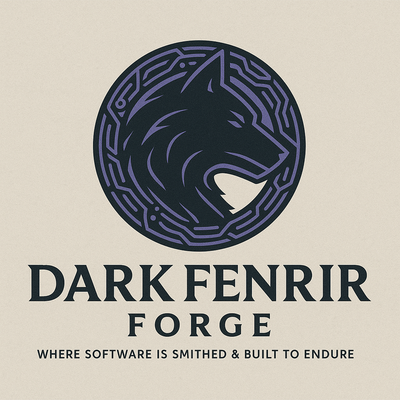

<div align="center">
  
  <h1>SF Forge</h1>
  <p><strong>The Salesforce developer toolkit that lives in your browser.</strong></p>
  <p>
    
    
    
    
  </p>
</div>

---

SF Forge is a Chrome extension built for Salesforce developers and administrators. It provides 18 integrated tools — from SOQL query execution and Apex test running to org security scanning and flow version management — all operating against a single active org target without leaving the browser.

---

## Table of Contents

- [Features](#features)
- [Installation](#installation)
- [Connecting to an Org](#connecting-to-an-org)
- [Auto-Update Setup](#auto-update-setup)
- [Tool Reference](#tool-reference)
- [Keyboard Shortcuts](#keyboard-shortcuts)
- [Architecture](#architecture)
- [Release Process](#release-process)
- [Contributing](#contributing)

---

## Features

### Command Center
| Tool | Description |
|------|-------------|
| **Dashboard** | Org health, session recovery, smart org switching, tool hub |
| **Connect Org** | SOAP login vault, OAuth flow, color-tagged org profiles |
| **Saved Workspace** | Per-org SOQL templates, favorite objects, notes |
| **Theme Engine** | 6 dark themes, accent color, density, update settings |

### Build & Inspect
| Tool | Description |
|------|-------------|
| **Inspector** | SOQL runner with history, visual query builder, column sort, record detail panel, object/field browser |
| **Metadata Studio** | Search Apex/LWC/Aura/Flows, inline Edit & Save, Apex test runner, Open in Setup deep-links |
| **Bulk Field Creator** | Create custom fields from CSV or grid — Text, Lookup, Picklist, Formula, and more |
| **Flow Analyzer** | Browse all flows, version history, one-click version activation/rollback |
| **LWC Lens** | Component overlay on live Lightning pages + source peek from DeveloperName |

### Operate & Secure
| Tool | Description |
|------|-------------|
| **Debug Logs** | Color-coded log viewer, severity filter, exception summary copy, trace flag integration |
| **Trace Flag Manager** | Create/delete Apex debug trace flags with per-channel log levels |
| **Permission Inspector** | Object-level and field-level security (FLS) grid across multiple profiles/permission sets |
| **Org Diff** | Name-presence and field-level metadata comparison between any two stored orgs |
| **Deployment Assistant** | Generate `package.xml` and `destructiveChanges.xml` for review |
| **REST Explorer** | Raw API request builder with JSON body, download, and `Ctrl+Enter` shortcut |
| **API Limits** | Live progress bars, sparkline trends, 60-second auto-refresh |
| **Apex Job Monitor** | `AsyncApexJob` + `CronTrigger` monitor with abort controls |
| **Security Health Scan** | 7-point checklist: guest users, password policy, Modify All Data, FLS, named credentials |

### Agentforce
| Tool | Description |
|------|-------------|
| **Agentforce Inspector** | `BotDefinition`, `BotVersion`, topic and action listing (requires Agentforce licence) |

---

## Installation

> **Requirements:** Google Chrome 114+, Developer mode enabled.

### Manual install (unpacked)

```bash
# 1. Download or clone this repo
git clone https://github.com/YOUR_USERNAME/sf-forge.git

# 2. Open Chrome extensions
# Navigate to: chrome://extensions

# 3. Enable Developer mode (toggle, top-right)

# 4. Click "Load unpacked"
# Select the sf-forge folder (the one containing manifest.json)

# 5. Open a Salesforce tab, then click the SF Forge icon
#    or use the side panel: View → Side Panel → SF Forge
```

> **After any update:** Navigate to `chrome://extensions` and click the **↻ refresh** icon on the SF Forge tile — do **not** remove and re-add. The extension ID stays stable as long as you reload the same folder.

---

## Connecting to an Org

SF Forge supports three connection methods:

### 1. Tab detection (fastest)
Open any Salesforce org in a Chrome tab → click **Detect Open Tabs** on the Dashboard → click **Use Org** on the detected tile.

### 2. SOAP credential login
Go to **Connect Org** → fill in Username, Password, Security Token, choose Production or Sandbox → click **Connect & Save Org**. The org profile is stored locally. Check "Remember credentials" for one-click reconnect after session expiry.

### 3. Session recovery
If your session has expired but you're still logged into Salesforce in a tab, go to **Dashboard → Session Recovery** → click **Extract SID from Open Tab**. SF Forge reads the `sid` cookie and reconnects without re-entering credentials.

---

## Auto-Update Setup

SF Forge checks your GitHub repo for new releases automatically.

**One-time setup:**
1. Open SF Forge → **Theme Engine** → scroll to **Update Settings**
2. Enter your GitHub owner/username and repo name
3. Click **Save & Check Now**

**After that:** SF Forge checks for updates every 6 hours and on every Chrome startup. When a new version is available, a purple banner appears with a **Download update** button that triggers Chrome's native downloader.

**Publishing a new version:**
1. Bump `"version"` in `manifest.json`
2. Create a GitHub Release tagged `vX.Y.Z`
3. Attach the extension `.zip` as a release asset
4. SF Forge detects it automatically within 6 hours

---

## Tool Reference

### Inspector — SOQL Runner

```
Query → Run (Ctrl+Enter) → Click column header to sort → Click row for full record detail
```

- **Visual Builder** — point-and-click: object → fields → WHERE → ORDER → LIMIT → Apply to Query
- **History** — last 20 queries per org, restored from the dropdown
- **Named queries** — save with a label, accessible from the history dropdown
- **Record detail** — click any result row for a full field/value panel with an "Open in Salesforce" link
- **Load All Pages** — paginates up to 10,000 records with progress indicator
- **Download CSV** — exports the current result set

### Metadata Studio

1. Select a type (ApexClass, ApexTrigger, LWC, Flow, etc.)
2. Enter a search term → **Search**
3. Per-row actions:
   - **Setup ↗** — opens the record directly in Salesforce Setup
   - **Download** — saves the source file locally
   - **Edit & Save** — inline editor → **Save to Org** PATCHes via Tooling API
   - **Run Tests** (ApexClass only) — POSTs to `/tooling/runTestsSynchronous`, renders per-method results

### Bulk Field Creator

```csv
# Paste CSV format:
Label,API Name,Type,Required,Related Object,Relationship Name,Picklist Values,Description
Customer Tier,Customer_Tier__c,Picklist,false,,,Bronze|Silver|Gold,Loyalty tier
Parent Account,Parent_Account__c,Lookup,false,Account,ParentAccount,,Parent org
```

- **Load Objects** — auto-runs on open, populates the object dropdown
- **Validate Only** — checks all payloads without creating anything
- **Create Fields** — creates sequentially, shows per-field pass/fail

### Flow Analyzer

- **Load Flows** — queries `FlowDefinitionView` via Tooling API
- **Inspect** — opens version history with status per version
- **Activate** — PATCHes `{ Status: 'Active' }` to the selected version, automatically deactivating the current one

### Trace Flag Manager

1. Run a SOQL query to find a User ID: `SELECT Id, Name FROM User WHERE Name = 'Your Name'`
2. Paste the ID into the **Traced Entity** field
3. Set log levels and expiry → **Create Trace Flag**
4. Debug logs appear in **Debug Logs** → Load Recent Logs

### Security Health Scan

Click **Run Security Scan** to execute 7 checks:

| Check | What it looks for |
|-------|-------------------|
| Guest User Accounts | Any `UserType = 'Guest'` users |
| Password Policy | Min length, complexity, expiry on System Administrator profile |
| Modify All Data (Profiles) | Profiles with `PermissionsModifyAllData = true` |
| View All Data (Profiles) | Profiles with `PermissionsViewAllData = true` |
| API Access (Non-Admin) | Non-admin standard profiles with `PermissionsApiEnabled = true` |
| Named Credentials | Lists all named credentials for audit |
| Permission Sets — Modify All Data | Permission sets with `PermissionsModifyAllData = true` |

Results export to CSV for audit trail.

---

## Keyboard Shortcuts

| Shortcut | Action |
|----------|--------|
| `Alt + 1` | Dashboard |
| `Alt + 2` | Connect Org |
| `Alt + 3` | Inspector |
| `Alt + 4` | REST Explorer |
| `Alt + 5` | Metadata Studio |
| `Alt + 6` | Debug Logs |
| `Alt + 7` | Flow Analyzer |
| `Alt + 8` | LWC Lens |
| `Alt + 9` | Bulk Field Creator |
| `Ctrl + Enter` | Run active view primary action (SOQL query, REST send, Apex execute) |

---

## Architecture

```
sf-forge/
├── manifest.json                    # MV3 manifest, permissions, content scripts
├── assets/
│   ├── brand/                       # Logos and character assets
│   └── icons/                       # Extension icons (16/32/48/128/256px)
├── src/
│   ├── app/
│   │   ├── index.html               # Side panel / options page shell
│   │   ├── app.css                  # Dark Fenrir theme system
│   │   ├── app.js                   # All 18 view functions (~2,900 lines)
│   │   └── modules/
│   │       ├── salesforce-api.js    # SalesforceApi class — REST, Tooling, SOQL
│   │       ├── org-manager.js       # Session detection, SOAP login, profile storage
│   │       └── update-checker.js    # GitHub Releases polling, semver compare
│   ├── background/
│   │   └── service-worker.js        # Alarms, message router, download handler
│   ├── content/
│   │   ├── session-bridge.js        # In-page fetch proxy for tab-session orgs
│   │   ├── salesforce-detector.js   # Org metadata extraction from page context
│   │   ├── lwc-lens.js              # Component overlay engine
│   │   └── lwc-lens.css             # Overlay styles
│   └── popup/
│       ├── popup.html               # Toolbar popup
│       ├── popup.css
│       └── popup.js
└── .github/
    └── ISSUE_TEMPLATE/              # Bug report and feature request templates
```

### Key design decisions

- **Single active org** — all tools target one org at a time, set via the active org lock bar. This prevents accidental cross-org actions.
- **No external services** — all data stays in the browser. Credentials are stored in `chrome.storage.local` only.
- **Session bridge pattern** — for tab-detected orgs, API calls are proxied through the content script (`session-bridge.js`) so `credentials: 'include'` applies the Salesforce session cookie automatically.
- **Stored session pattern** — for credential-login orgs, requests go directly via `Authorization: Bearer` with the stored session ID.
- **Tooling API for metadata** — Apex, LWC, Flow, TraceFlag, DebugLevel, CustomField all use `/services/data/v66.0/tooling/` endpoints.

---

## Release Process

```bash
# 1. Make changes, bump version in manifest.json
# 2. Update CHANGELOG.md
# 3. Zip the extension (exclude .git, *.bak)
zip -r sf-forge-vX.Y.Z.zip sf-forge/ -x "*.git*" -x "*.bak"

# 4. Create a GitHub Release tagged vX.Y.Z
# 5. Attach sf-forge-vX.Y.Z.zip as a release asset
# 6. SF Forge auto-detects the update within 6 hours
```

---

## Contributing

SF Forge is a one stop shop for Salesforce Admins and Developers alike. For bugs or feature requests, open a GitHub issue using the provided templates.

**Style conventions:**
- All Apex file headers follow the Jon Murphey standard (Class Name, Author, Created, Modified, Description, Change History table)
- Salesforce CLI uses `sf` not `sfdx`
- API version: `v66.0` for REST/Tooling, `v59.0` for SOAP login endpoint only

---

<div align="center">
  <sub>Built and maintained by <strong>Jon-Michael Murphey</strong> · Dark Fenrir Forge</sub>
</div>
